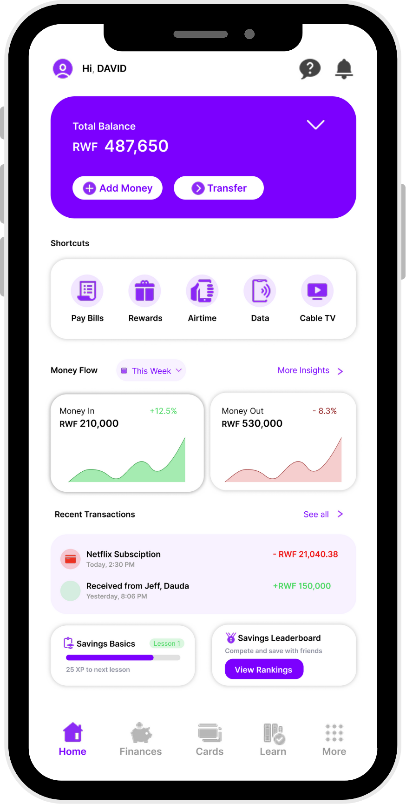

# Antwise: AI-Powered Fintech Solution

## Description
Antwise is an AI-powered fintech application designed to enhance financial literacy, budgeting, and savings for young Africans. This demo showcases:
- A responsive, intuitive user interface with real-time budget insights and transaction tracking
- Savings challenges with progress indicators
- Integration with dummy backend data to simulate real-time financial management

## Website
To learn more about Antwise, visit [antwise.app](https://antwise.app).  
The web repository is available at [GitHub](https://github.com/thedavidemmanuel/antwise-web).

## Setup & Environment
### Prerequisites
- Node.js (>= 16.x)
- Expo CLI
- Android Studio / Xcode for device emulation
- Git

### Installation & Running
1. **Clone the repository:**
   ```sh
   git clone https://github.com/yourusername/antwise.git
   cd antwise
   ```
2. **Install dependencies:**
   ```sh
   npm install
   ```
3. **Configure Environment:**
   Create a `.env` file in the project root with your API keys and other necessary configurations.
4. **Launch the App:**
   ```sh
   npm run start    # For Expo users
   npm run android  # For Android emulator
   npm run ios      # For iOS simulator (Mac only)
   ```

## Designs & Interface
- **Wireframes / Mockups:**  
  [Figma Prototype](https://www.figma.com/design/YNLgFJsCiITtIIET21cgZt/Antwise?node-id=115-362&t=X9TztVyixHqit6mo-1)  
- **Screenshots:**  
  

## Deployment Plan
- **Development:** Run locally using Expo’s development server.
- **Staging & Production:** Planned for cloud hosting (Firebase/AWS) with CI/CD integration via GitHub Actions.
- **Future Enhancements:** API integration, detailed analytics, and refinements based on feedback.

## Video Demonstration
[Watch the Demo](https://www.loom.com/share/6ed36643087748d5ac5f443e4db3b8da?sid=fa3e9e5a-3e56-45c8-8dcd-8998184c79de)

## Functionality Highlights
- **Frontend Development:**
  - Responsive React Native components
  - Intuitive navigation with a bottom nav bar and floating action button
  - UI elements for balance cards, transaction lists, and savings modules
- **Backend Simulation:**
  - Dummy financial data integration for real-time budget and transaction visualization
- **Navigation & Layout:**
  - Clear, logical layout supporting effortless user interactions

## Code Files
- **Frontend:** Located in the **app** directory  
  (Key components include Home screen, MoneyFlowChart, and style definitions)
- **Backend:** Located in the **backend** directory  
  (API endpoints and database schema for demonstration)

## Rubric Criteria Overview
- **Requirements Understanding:** Demonstrates effective use of design tools and clear project functionalities.
- **Environment Setup:** Well-configured development environment enabling seamless work.
- **Navigation & Layout:** Logical, user-friendly structure enhancing usability.
- **Functionality:** Delivers an MVP reflecting core features and intended user experiences.

---
This README is intended for the initial software demo submission, emphasizing Antwise’s core functionalities without extraneous details.

# Welcome to your Expo app 👋
This is an [Expo](https://expo.dev) project created with [`create-expo-app`](https://www.npmjs.com/package/create-expo-app).

## Get a fresh project

When you're ready, run:

```bash
npm run reset-project
```

This command will move the starter code to the **app-example** directory and create a blank **app** directory where you can start developing.

## Learn more

To learn more about developing your project with Expo, look at the following resources:

- [Expo documentation](https://docs.expo.dev/): Learn fundamentals, or go into advanced topics with our [guides](https://docs.expo.dev/guides).
- [Learn Expo tutorial](https://docs.expo.dev/tutorial/introduction/): Follow a step-by-step tutorial where you'll create a project that runs on Android, iOS, and the web.

## Join the community

Join our community of developers creating universal apps.

- [Expo on GitHub](https://github.com/expo/expo): View our open source platform and contribute.
- [Discord community](https://chat.expo.dev): Chat with Expo users and ask questions.

